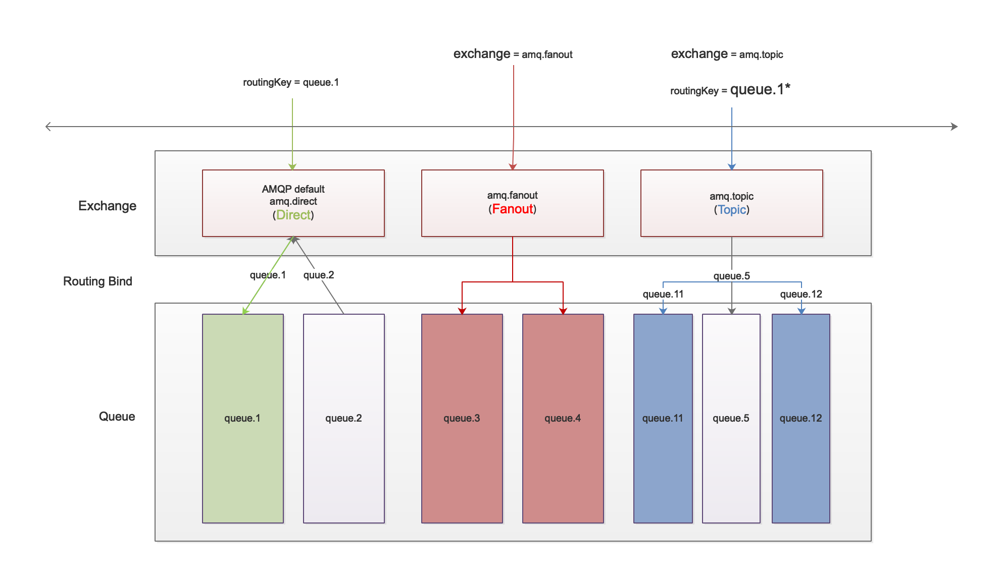

# One figure clearly show the differences among the 3 types of exchange in RabbitMQ

## Some key points you need pay attention to before using RabbitMQ as your message broker.

- there are many exchange created by RabbitMQ automatically whose name looks like amq.\*, such as (AMQP default) | amq.direct | amq.fanout | anq.topic
- Queue created without exchange will be bound to the default one named AMQP default whose type is direct with the routing key equals to queue's name

## direct

    If only routing key is provied, then the default AMQP exchange will be used

## fanout

    Queue bound to fanout exchange will have no routing key because it will browdcast the message to all of it's queue.

    There is no need to identify, as we can see only exhange is provied, whereas leave the routing key empty string.

## topic

    different from direct exchange, topic exchange support using a pattern of the group of routing key, as a result, it sends the message only to those group whose routing key match the pattern.

[样例代码](https://github.com/chinashuai/spring-boot-example-all/tree/master/spring-boot-rabbitmq/src/main/java/com/example)
